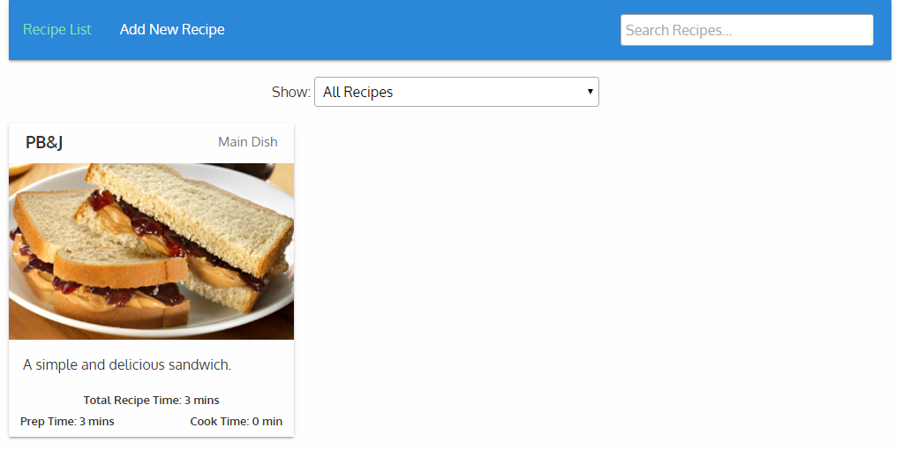
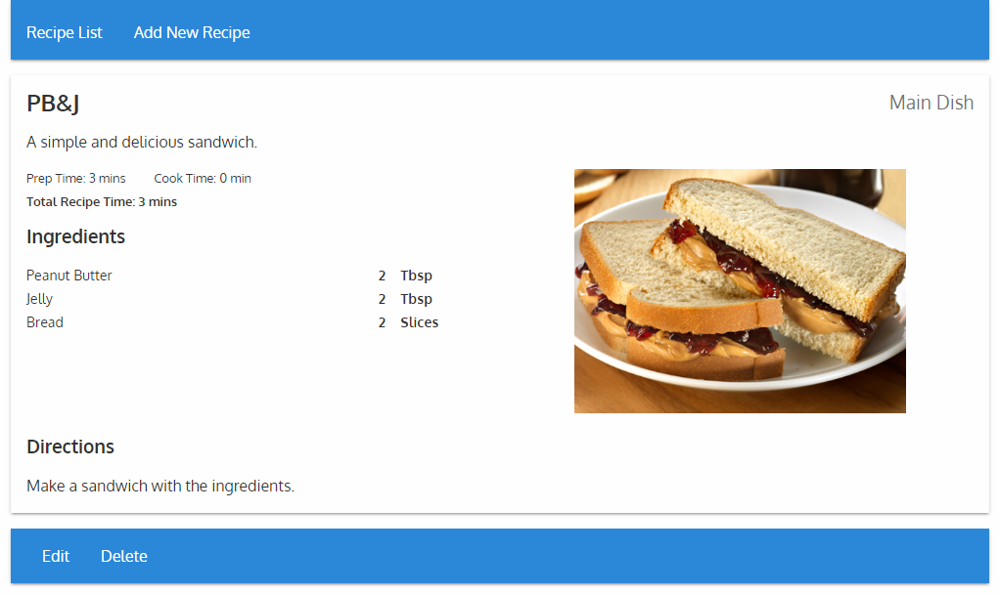
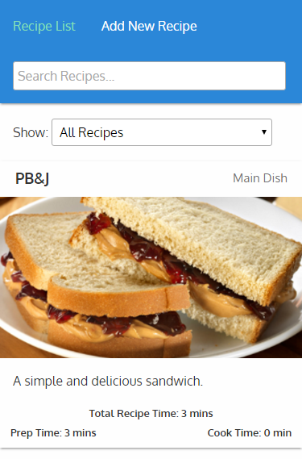

# Recipes
An Angular 2 Single Page Application (SPA) for tracking your recipes.

Here's an example of the searchable, filterable, recipes list page (the default route):

And this is what it looks like when you open a recipe:

And of course, it's mobile-first so it looks nice on any screen:

## Usage
This project assumes you have [`npm`](https://www.npmjs.com/) and [`gulp`](http://gulpjs.com/) installed globally. It also uses `scss-lint` (`gem install scss-lint`).

 * Clone the repo: `git clone https://github.com/kiswa/recipes`
 * Install dependencies: `npm install`
 * Build the app: `gulp`

You'll need to make sure the `dist/api` directory is writable. The `mod_rewrite` module must also be enabled in Apache.

## Tests

Tests are in the `test` directory.

To run the tests, use the command `gulp test`. This generates the JavaScript files, then runs the tests against them.

You can also have the tests auto-run when changed by running the `gulp watchtests` command.

To see code coverage from the tests, use the `gulp coverage` command. This runs the tests, and generates `coverage.html` (it's a bit slower than just tests, hence the separate command).

## Production

For a production setup, uncomment the lines in `boot.ts` to put Angular in production mode.

You may also want to run the minification task to minify vendor files: `gulp minify`

## API Development

If you add a model or controller to the API, you will need to run `gulp composer` to update the autoloader.

## Auto-Refresh when Developing

You may run `gulp watch` in a stand-alone terminal to have the output automatically updated when you save changes.

If you install the [fb-flo plugin](https://chrome.google.com/webstore/detail/fb-flo/ahkfhobdidabddlalamkkiafpipdfchp) on Chromium (Chrome) you can have automatic browser refresh as well.
